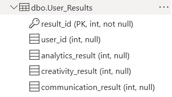
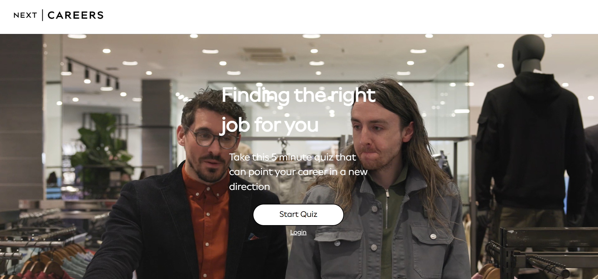
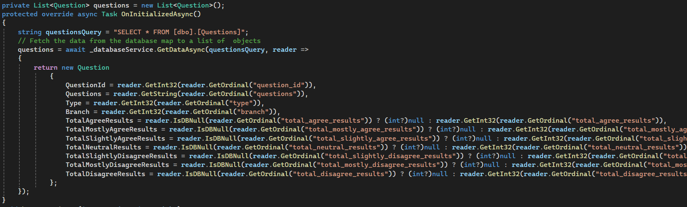
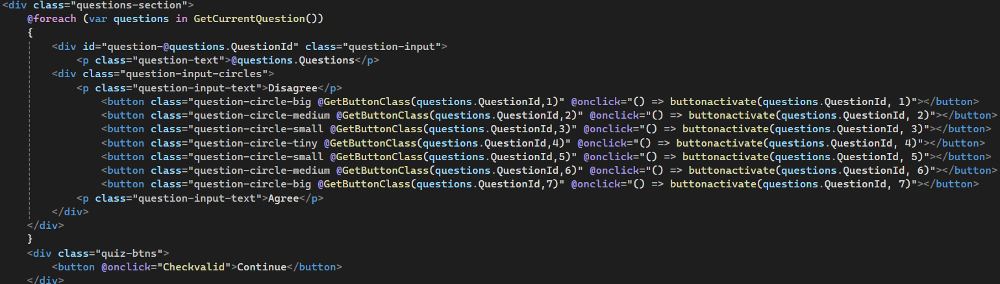
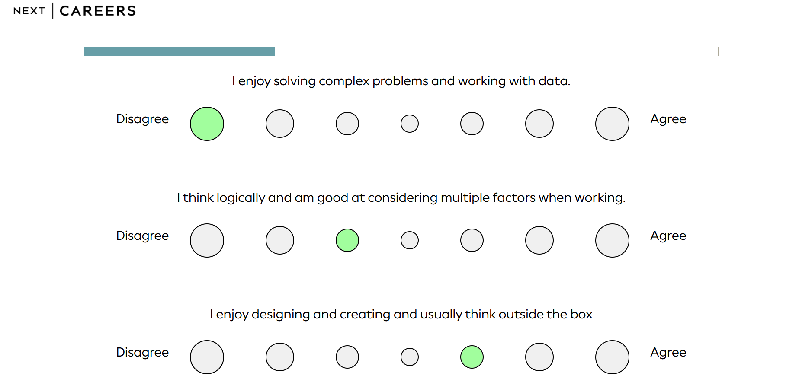
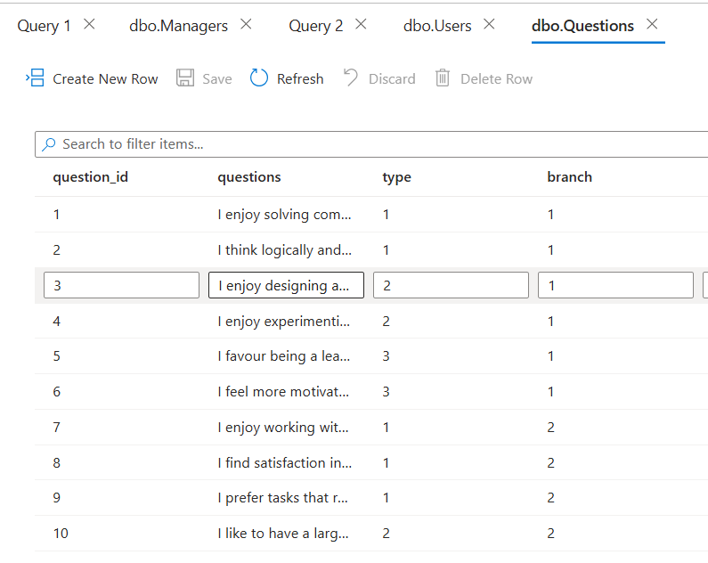
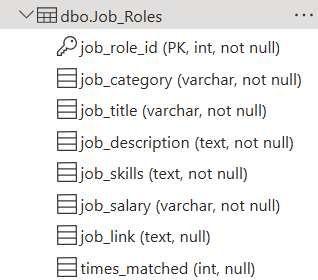
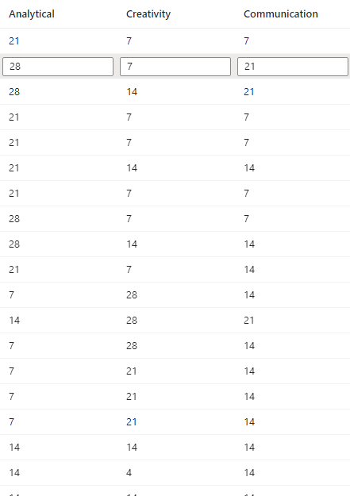

# Week 9 Tasks Completed
## Monday
- Added a new table named 'User_Results' to store user's results after their quiz(this will be overwritten if they have existing results and they take another quiz)
- Changed our NEXT logo to the Client's Provided logo.
- Changed the styling for our home page 'Start Here' button
### Evidence:

  
  

## Tuesday
- Added details for the 'Questions' table from the database to our quiz page.
- Fixed issue with buttons during the quiz not being selected after click
- Addes two columns to Questions table names 'type' and 'branch'

### Evidence:
  
  

  
  

## Wednesday
- Created a new table named 'Job_Roles' that will store various job roles the candidate could be suggested for after the quiz and will display their relevant details and a link if possible
### Evidence:
 
 
## Thursday
- Filled out our template for our Testing plan outlining everything used to test our project and compare our test cases to check whether they work or not.
- Added extra columns to the 'Job_Roles' to allow each job role to hold values for each category(Analytics,Creativity,Communication).
### Evidence:
 
 
## Friday
### Evidence:
